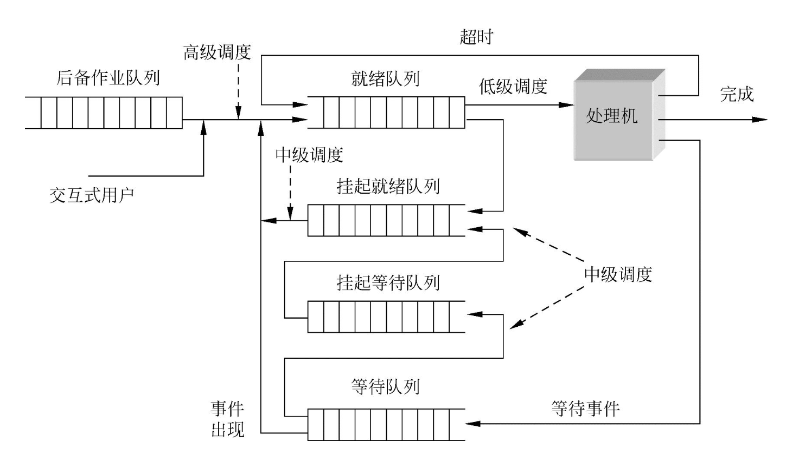

## The role of scheduling
- **The purpose of processor scheduling**: Allocate the CPU to the appropriate process.
- **Scheduling function**: Organize and maintain the queue of ready processes, including determining the scheduling algorithm and managing these queues according to the algorithm.
- **Dispatching function**: When the CPU is idle, remove a process control block (PCB) from the ready queue and put the process into execution.

Usually, the above functions are collectively referred to as "process scheduling". The scheduler should not only pay attention to the execution order of the processes, but also consider **CPU utilization efficiency** to ensure that the system can efficiently execute multiple tasks.

## Scheduling level
Processor scheduling is one of the core functions of the operating system. It determines when different processes get CPU execution time. The scheduling system is divided into three main levels: **High-level scheduling**, **Intermediate scheduling** and **Low-level scheduling**.

### **High-level scheduling (job scheduling / long-term scheduling):**
- **Function**: Determine which jobs (processes or tasks) are transferred from external memory to memory for execution. The main task of high-level scheduling is to select jobs in external memory (usually called jobs in the "backup queue") and load them into memory.
- **Scheduling frequency**: Generally low, the execution cycle is usually once every few minutes.
- **Scheduling goal**: Optimize the use of system resources, ensure stable system operation, and ensure that enough jobs can enter the memory for processing.

### **Intermediate scheduling (memory scheduling / medium-term scheduling):**
- **Function**: The main purpose is to improve memory utilization and system throughput. It is responsible for swapping processes between memory and external memory to ensure that when memory space is insufficient, some processes can be temporarily swapped out to release memory for other processes.
- **Scheduling frequency**: The execution frequency is between job scheduling and process scheduling, usually once every few seconds to minutes.
- **Scheduling goal**: Optimize the allocation and scheduling of memory resources to avoid system performance degradation caused by excessive memory usage.

### **Low-level scheduling (process scheduling / short-term scheduling):**
- **Function**: This is the most basic scheduling level, which mainly determines which process in the ready queue gets the CPU for execution when the CPU is available. Low-level scheduling is executed frequently, usually every millisecond or tens of milliseconds.
- **Scheduling frequency**: Very frequent, usually every few milliseconds or tens of milliseconds.
- **Scheduling goal**: Ensure that the CPU is effectively used, arrange process execution reasonably, balance the execution time of each process, and improve system response speed.

## Three-level scheduling relationship

## Analogy between the three types of scheduling and the "toilet and toilet" example

1. **Advanced scheduling (job scheduling)**:

- **Background**: There are many people waiting in line to use the toilet, but the space in the toilet is limited and not everyone can enter.
- **Function**: Advanced scheduling studies how to decide which people (jobs) can enter the toilet (memory) from the outside. These people have never entered the toilet before.
- **Analogy**: Advanced scheduling is equivalent to deciding to transfer the waiting people from outside the toilet (external memory) to the toilet (memory) and give them the opportunity to fight for the use of the toilet (CPU).

3. **Intermediate scheduling (swap scheduling)**:

- **Background**: Some people have entered the toilet but cannot come out for the time being (they cannot use resources temporarily or are waiting for other resources).

- **Function**: Intermediate scheduling is responsible for studying how to let those who are in the toilet but do not need the toilet temporarily go out first, free up space, and then let them come back as needed.

- **Analogy**: Intermediate scheduling is equivalent to letting these "unable to urinate" people temporarily exit the toilet (swap out from memory to external memory), and let them re-enter the toilet when they have needs or resources are available.

4. **Low-level scheduling (process scheduling)**:

- **Background**: There are already several people in the toilet, and now they need to arrange how to use the toilet (CPU).

- **Function**: Low-level scheduling is mainly responsible for allocating the order and time for people in the toilet to use the toilet, so that everyone can use resources fairly.

- **Analogy**: Low-level scheduling is equivalent to arranging how people who have entered the toilet use the toilet, such as letting each person take turns to use it for a period of time, or giving priority to people with urgent needs.