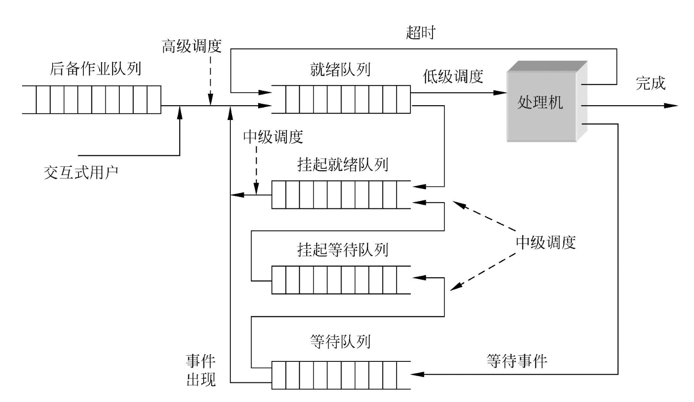

## 調度的作用
- **處理機調度的目的**：將 CPU 分配給適當的進程。
- **調度功能**：組織和維護就緒進程佇列，包括確定調度演算法，並按演算法來管理這些佇列。
- **分派功能**：當 CPU 閒置時，從就緒佇列中移出一個行程控制區塊（PCB），並將該行程投入執行。

通常，以上功能統稱為「進程調度」。調度程序不僅要專注於進程的執行順序，還要考慮**CPU 的利用效率**，確保系統能夠有效率地執行多個任務。

## 調度級別
處理機調度是作業系統的核心功能之一，它決定了不同行程何時獲得 CPU 的執行時間。調度系統分為三個主要層級：**高階調度**、**中階調度**和**低階調度**。

### **高階排程（作業排程 / 長期排程）:**
- **功能**：決定哪些作業（行程或任務）從外存調入記憶體執行。進階調度的主要任務是選擇外存中的作業（通常稱為「後備佇列」中的作業）將其載入到記憶體中。
- **調度頻率**：一般較低，執行週期通常是幾分鐘一次。
- **調度目標**：最佳化系統資源的使用，確保系統穩定運行，確保足夠的作業可以進入記憶體進行處理。

### **中階調度（記憶體調度 / 中期調度）:**
- **功能**：主要目的是提高記憶體的使用率和系統吞吐量。它負責將進程在記憶體和外存之間進行交換，確保在記憶體空間不足時，某些進程可以被暫時換出，釋放記憶體給其他進程使用。
- **調度頻率**：執行頻率介於作業調度和進程調度之間，通常是幾秒到幾分鐘一次。
- **調度目標**：優化記憶體資源的分配和調度，避免記憶體過度佔用導致的系統效能下降。

### **低階調度（進程調度 / 短期調度）:**
- **功能**：這是最基本的調度層級，主要決定在 CPU 可用時，哪一個就緒佇列中的程序會獲得 CPU 進行執行。低階調度執行頻繁，一般以毫秒級或幾十毫秒一次進行調度。
- **調度頻率**：非常頻繁，通常是每幾毫秒或幾十毫秒進行一次調度。
- **調度目標**：確保 CPU 有效利用，合理安排進程執行，平衡各程序的執行時間，提升系統響應速度。

## 三級調度關係

## 三種調度與「廁所和馬桶」範例的類比

1. **高階排程（作業排程）**：

 - **背景**：有很多人在排隊等待上廁所，但廁所內的空間有限，無法讓所有人都進去。
 - **作用**：高級調度研究的是如何決定哪些人（作業）可以從外部進入廁所（內存）。這些人之前從未進入過廁所。
 - **類比**：高級調度相當於決定把等待的人從廁所外（外存）調入到廁所內（內存），並讓他們有機會去爭取使用馬桶（CPU）。

3. **中級調度（交換調度）**：

 - **背景**：有些人已經進入廁所，但一時上不出來（暫時無法使用資源或正在等待其他資源）。
 - **作用**：中級調度負責研究如何讓這些在廁所內但暫時不需要馬桶的人先出去，釋放空間，再根據需要讓他們回來。
 - **類比**：中級調度相當於讓這些「尿不出來」的人暫時退出廁所（從內存換出到外存），等他們有需求或資源可用時再讓他們重新進入廁所。

4. **低階調度（進程調度）**：

 - **背景**：廁所裡已經有幾個人，現在需要安排他們如何使用馬桶（CPU）。
 - **作用**：低階調度主要負責分配廁所內的人使用馬桶的順序和時間，以便所有人都能公平地使用資源。
 - **類比**：低階調度相當於安排已經進入廁所的人如何使用馬桶，例如讓每人輪流用一段時間，或優先讓緊急需求的人先用。