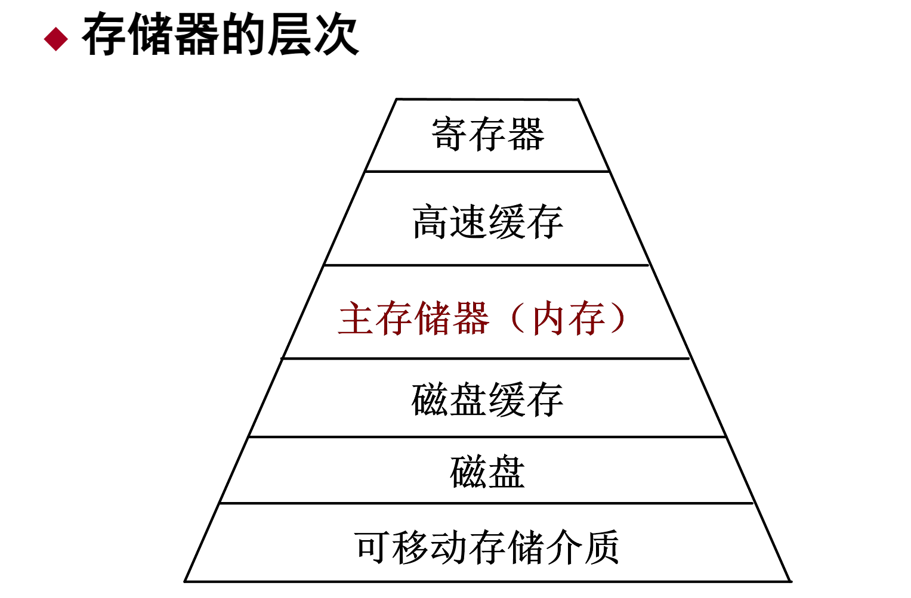

## Main Memory Overview

Main memory (abbreviated as main memory or memory) is a memory that the CPU can directly access instructions and data, and plays a core role in the computer system. Its main features and functions include:

**Structure of main memory**:

- Main memory can be divided into **system area** and **user area**:

- **System area**: located at the bottom of the main memory, storing the code and static data structure of the operating system kernel to avoid overwriting by other programs or data.

- **User area**: used to store user programs and data, allocated as the user program runs, and released after execution.

**Objectives of storage management**:

- Through effective storage management, optimize the management of the user area and improve the utilization of main memory, so as to achieve a balance between cost, speed and scale.

## Storage structure of main memory

Main memory is an important part of the computer memory hierarchy, usually composed of multiple storage levels, each layer differs in speed, cost and capacity to provide efficient data access and storage.

## Functions of storage management

**Allocation and recycling of main memory space**:

- Dynamically allocate or recycle main memory space according to process requirements to improve resource utilization.

**Address translation**:

- Convert logical addresses to physical addresses and perform relocation to ensure the correct storage location of the program in the main memory.

**Sharing and protection of main memory space**:

- Realize the sharing of main memory resources and sharing of specific areas, and control read and write permissions to protect the security of memory data.

**Expansion of main memory space**:

- Use virtual storage technology to expand the main memory space, improve the system's multi-tasking capabilities, and enable users to run larger programs.

Storage management is an important part of the operating system, ensuring the effective allocation, sharing, protection and expansion of main memory, thereby supporting multi-tasking and data security.