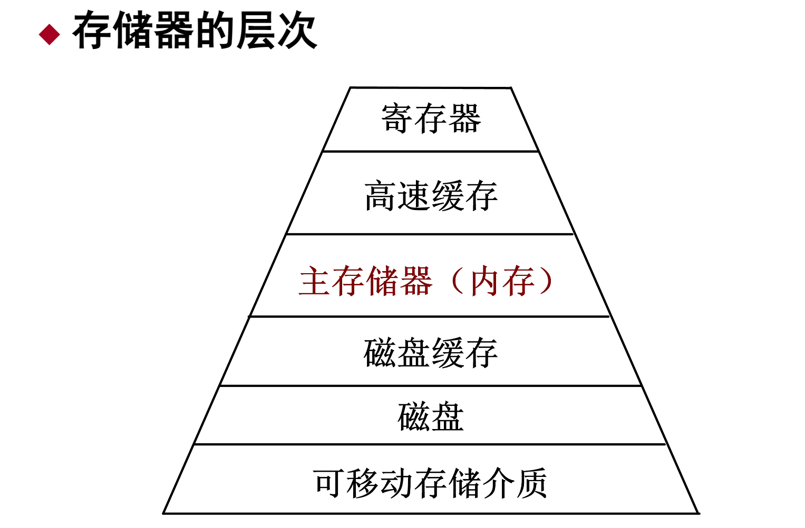

## 主存储器概述

主存储器（简称主存或内存）是CPU能够直接存取指令和数据的存储器，在计算机系统中起着核心作用。其主要特点和作用包括：

 **主存的结构**：

   - 主存可分为**系统区**和**用户区**：
     - **系统区**：位于主存底端，存放操作系统内核的代码和静态数据结构，避免其他程序或数据的覆盖。
     - **用户区**：用于存放用户程序和数据，随着用户程序的运行进行分配，执行结束后释放。

 **存储管理的目标**：

   - 通过有效的存储管理，优化用户区的管理，提升主存的利用率，从而在成本、速度和规模之间取得平衡。

## 主存的存储结构

主存是计算机存储器层次结构的重要组成部分，通常由多个存储层次构成，每一层在速度、成本和容量上有所不同，以提供高效的数据访问和存储。

## 存储管理的功能

 **主存空间的分配与回收**：

   - 根据进程需求动态分配或回收主存空间，以提高资源利用率。

 **地址转换**：

   - 将逻辑地址转换为物理地址，执行重定位，以确保程序在主存中的正确存放位置。

 **主存空间的共享和保护**：

   - 实现主存资源的共享和特定区域的共享，并控制读写权限以保护内存数据的安全性。

 **主存空间的扩充**：

   - 利用虚拟存储技术扩展主存空间，提高系统的多任务处理能力，使用户能够运行更大的程序。

存储管理是操作系统的重要组成部分，确保主存的有效分配、共享、保护和扩充，从而支持多任务运行和数据安全。