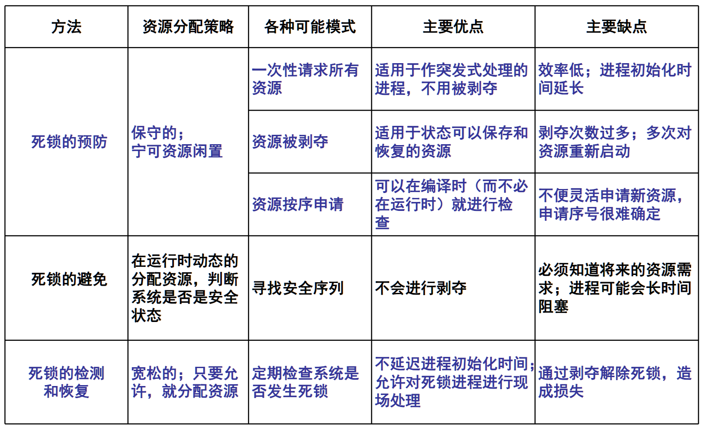

## 1. Deadlock prevention

**Goal**: Take measures before the system runs to ensure that deadlock does not occur.

**Method**: Destroy one or more of the four necessary conditions for deadlock, such as:

- **Destroy mutual exclusion conditions**: Make resources shareable and avoid resource monopoly.

- **Destroy request and hold conditions**: Require that processes cannot request new resources while holding resources.

- **Destroy non-deprivation conditions**: Allow the system to forcibly deprive resources.

- **Destroy circular waiting conditions**: Ensure that resource requests are made in a certain order to avoid circular waiting.

## 2. Deadlock prevention

**Goal**: Prevent the system from entering an unsafe state by dynamically allocating resources, thereby avoiding deadlock.

**Method**: For example, the banker's algorithm, when allocating resources, simulates the state after resource allocation, and only allocates resources when resource allocation does not cause deadlock.

**Disadvantages**:

- Resource application analysis and calculation are complex, and the system overhead is large.

- It is difficult to accurately grasp the maximum number of resources required by each process before the process is executed.

## 3. Detect deadlock

**Goal**: Allow the system to deadlock during operation, but detect deadlock in time through detection mechanism.

**Method**: Use resource allocation graph or other algorithms to regularly check the system status and detect whether there is deadlock.
**Disadvantage**: Deadlock needs to be resolved by depriving resources, which may cause losses to the system or users.

## 4. Resolve deadlock

**Goal**: After detecting deadlock, take measures to free the process from the deadlock state.

**Method**: The common method is to cancel some processes, recycle their resources, and allocate these resources to the blocked process so that it can continue to run.

**Challenge**: Due to the diversity of the order of concurrent process advancement, it is difficult for the system to effectively resolve deadlock.

> The above four methods, from 1） to 4）, gradually weaken the degree of prevention of deadlock, but the corresponding resource utilization is improved, and the frequency of process blocking due to resource factors is reduced (that is, the degree of concurrency is increased).

## Comparison of basic methods for handling deadlocks

