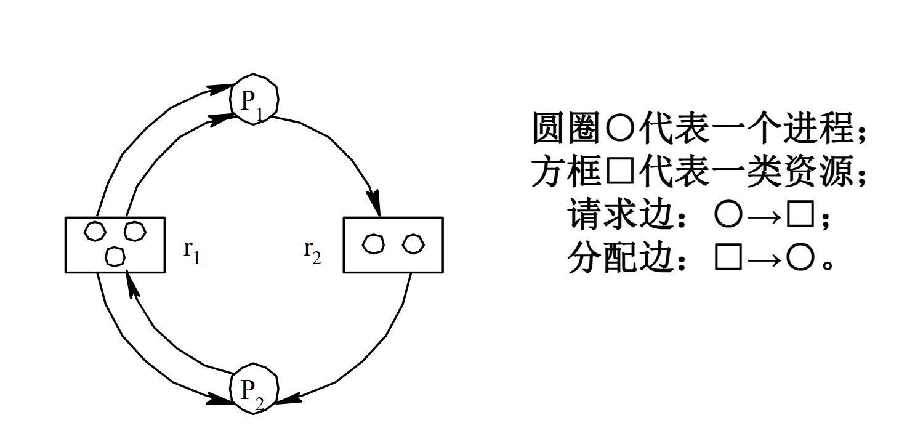

**死锁的检测**是一种不同于预防和避免的解决死锁问题的方法，它对资源分配没有严格限制，而是在系统运行中定期检查是否发生了死锁。一旦发现死锁，系统会采取措施来解除它。下面是这种方法的关键点：

## 死锁检测
- **方法**：不对资源分配进行过多限制，系统允许进程自由申请资源。但系统会定期运行一个“死锁检测程序”，检查系统是否处于死锁状态。如果发现死锁，系统会采取措施解决问题（如杀死某个进程、回收资源等）。
- **工作原理**：
    - 系统通过**进程资源分配图**来描述进程和资源之间的关系。每个进程和资源通过有向边连接，表示资源的申请和分配。
    - **进程资源分配图**是一个图模型
     
     其中：
        - **进程**是图中的节点，表示进程请求或占用的资源。
        - **资源**也是节点，表示系统中可供进程请求和占用的资源。
        - **边的方向**：从进程指向资源表示该进程正在请求资源；从资源指向进程表示资源已经被分配给该进程。

## 检测过程
1. **构建资源分配图**：通过记录每个进程和资源之间的关系，系统定期构建一个进程资源分配图。
2. **判断死锁**：通过图中的环路来判断死锁。如果在图中存在**环**，并且环中的每个进程都等待环中其他进程持有的资源，那么这些进程就形成了一个死锁。
3. **解除死锁**：一旦发现死锁，系统可以采取以下措施来解除死锁：
     - **终止进程**：选择一个或多个进程终止，释放资源，打破死锁。
     - **回滚操作**：将进程回滚到某个安全的状态，以便释放资源并重新开始执行。
    

