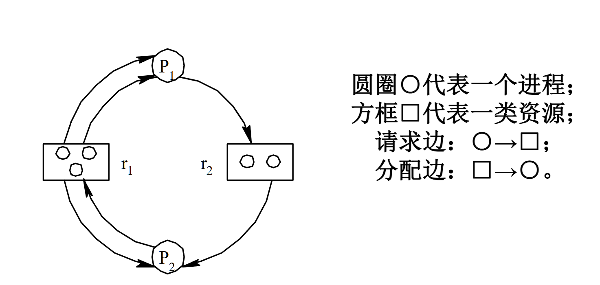

**死鎖的偵測**是一種不同於預防和避免的解決死鎖問題的方法，它對資源分配沒有嚴格限制，而是在系統運作中定期檢查是否發生了死鎖。一旦發現死鎖，系統會採取措施來解除它。以下是這種方法的關鍵點：

## 死鎖偵測
- **方法**：不對資源分配進行過多限制，系統允許進程自由申請資源。但係統會定期執行一個“死鎖檢測程式”，檢查系統是否處於死鎖狀態。如果發現死鎖，系統會採取措施解決問題（如殺死某個流程、回收資源等）。
- **工作原理**：
 - 系統透過**進程資源分配圖**來描述進程和資源之間的關係。每個進程和資源透過有向邊連接，表示資源的申請和分配。
 - **進程資源分配圖**是一個圖模型
 
 其中：
 - **進程**是圖中的節點，表示進程請求或佔用的資源。
 - **資源**也是節點，表示系統中可供進程請求和佔用的資源。
 - **邊的方向**：從行程指向資源表示該行程正在請求資源；從資源指向行程表示資源已經被指派給該行程。

## 檢測過程
1. **建構資源分配圖**：透過記錄每個流程和資源之間的關係，系統定期建構一個進程資源分配圖。
2. **判斷死鎖**：透過圖中的環路來判斷死鎖。如果在圖中存在**環**，並且環中的每個進程都等待環中其他程序持有的資源，那麼這些進程就形成了一個死鎖。
3. **解除死鎖**：一旦發現死鎖，系統可以採取以下措施來解除死鎖：
 - **終止進程**：選擇一個或多個進程終止，釋放資源，打破死鎖。
 - **回滾操作**：將程序回滾到某個安全的狀態，以便釋放資源並重新開始執行。