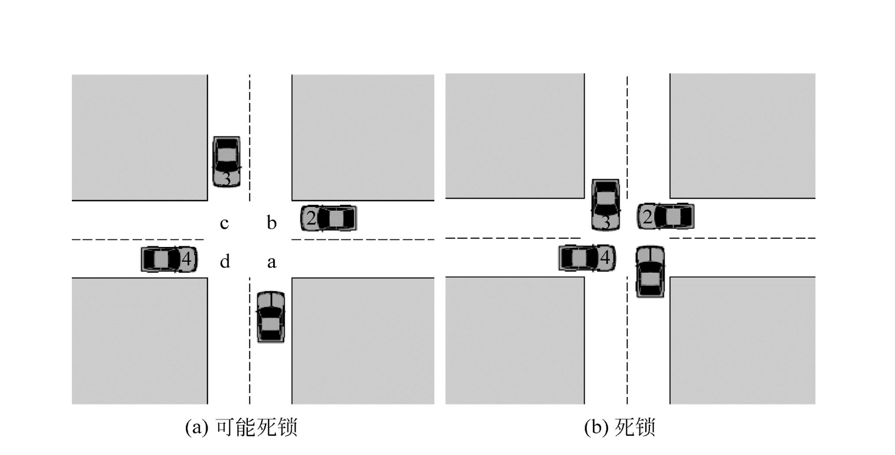

## 1. Definition of deadlock

Deadlock refers to the phenomenon that each process waits for the resources in the hands of the other, causing all processes to be blocked and unable to move forward.

## Main causes of deadlock

1. **Competition for resources**

   - **Description**: When the resources in the system are not enough to meet the needs of multiple processes at the same time, resource competition will be triggered, resulting in deadlock. For example, multiple processes need to access a printer or database at the same time, but the number of these resources is limited.

   - **Example**: Two processes need to access a printer at the same time, but only one printer is available in the system. One process occupies the printer, and the other process is blocked, resulting in competition.

2. **Improper order of process advancement**

   - **Description**: When the order of requesting and releasing resources during the process is not correct, deadlock will also occur. For example, one process holds resource A and waits for resource B, while another process holds resource B and waits for resource A.

   - **Example**: Process A holds resource 1 and requests resource 2; while process B holds resource 2 and requests resource 1. If there is no proper sequence control, process A and process B will wait for each other and cannot continue to execute.

## Necessary conditions for deadlock

Deadlock usually requires the following four conditions to be met at the same time:

1. **Mutually exclusive condition**: Resources cannot be shared by multiple processes, that is, each resource can only be occupied by one process.

2. **Request and hold condition**: While holding at least one resource, the process makes a new resource request, and the resource is occupied by other processes.

3. **Non-deprivation condition**: The resources obtained by the process cannot be deprived before they are used up, and can only be released by the process itself.

4. **Circular waiting condition**: There is a process chain, so that each process is waiting for the resources held by the next process in the chain.

### Special attention

As long as one of the necessary conditions is not met, deadlock can be eliminated.