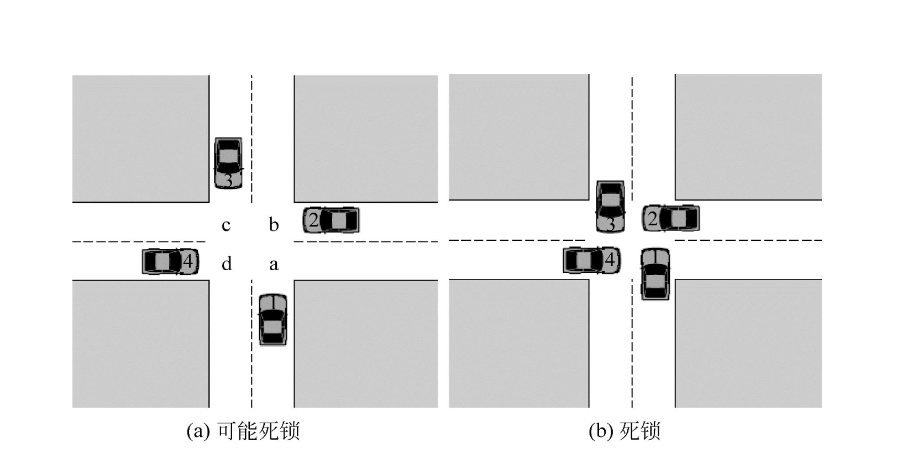

## 1. 死鎖的定義

死鎖指的是各過程互相等待對方手上的資源，導致所有進程都阻塞，無法前進的現象。

## 死鎖產生的主要原因

1. **競爭資源**

 - **描述**：當系統中的資源不足以同時滿足多個進程的需求時，會引發資源競爭，從而導致死鎖。例如，多個進程需要同時存取印表機或資料庫，但這些資源數量有限。

 - **範例**：兩個進程同時需要存取一台印表機，但係統中只有一台印表機可用。一個進程佔用了印表機，另一個進程因此被阻塞，形成競爭。

2. **進程推進順序不當**
 - **描述**：當進程在運行過程中請求和釋放資源的順序不當，也會導致死鎖。例如，一個行程持有資源 A，同時等待資源 B，而另一個行程持有資源 B，同時等待資源 A。

 - **範例**：進程 A 持有資源 1，並請求資源 2；而進程 B 持有資源 2，並請求資源 1。如果沒有適當的順序控制，就會導致進程 A 和進程 B 互相等待，無法繼續執行。

## 死鎖的必要條件

死鎖的產生通常需要以下四個條件同時滿足：

1. **互斥條件**：資源不能被多個行程共享，即每個資源只能由一個行程佔用。
2. **請求與保持條件**：進程在保持至少一個資源的情況下，又提出了新的資源請求，而該資源被其他進程佔用。
3. **不剝奪條件**：進程已獲得的資源在未使用完之前，不能被剝奪，只能由進程自己釋放。
4. **循環等待條件**：存在一個行程鏈，使得每個行程都在等待鏈中的下一個行程所持有的資源。

### 特別注意

只要有必要條件不滿足，則死鎖就可以排除。