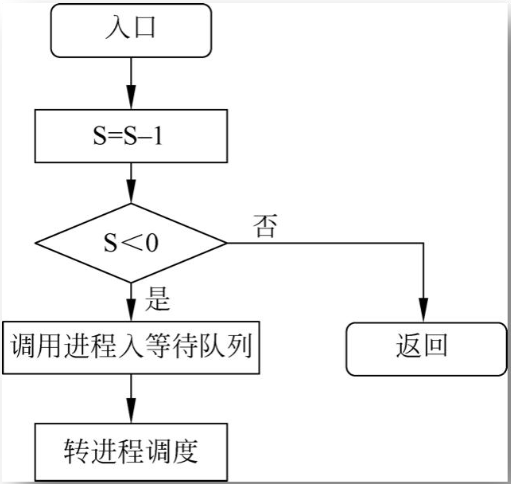
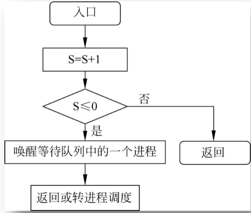

## 信号量的概念
- **信号量** 是一个整数，它代表着系统中某个资源的可用数量。
  - 当信号量 S 大于或等于零时，表示有 S 个可供并发进程使用的资源。
  - 当信号量 S 小于零时，|S| 代表有多少进程在等待该资源的使用。

## 信号量的操作
信号量只能通过 **PV 操作**（P 操作和 V 操作）来访问。

## 信号量的分类
信号量根据用途的不同，分为两种类型：

1. **公用信号量**：
    - 所有相关进程都可以对其进行 P 操作和 V 操作。
    - 公用信号量的初值通常为 1，用于实现进程的互斥访问（例如，保证对共享资源的独占访问）。

2. **私有信号量**：
    - 只有拥有该信号量的进程可以执行 P 操作，其他进程只能执行 V 操作。
    - 私有信号量的初值常为 0 或正整数，用于实现进程同步，确保某些操作的顺序性。

## P 操作和 V 操作
你描述的P操作和V操作分别对应信号量的“等待”（P）和“释放”（V）操作，其主要功能如下：

1. **P操作**（等待操作）：
   
       **①**：将信号量S减1。

       **②**：如果S减1后的值大于或等于零，说明信号量有资源可用，进程可以继续执行。

       **③**：如果S减1后的值小于零，表示没有足够资源，进程需要阻塞，并被放入信号量的等待队列中，等待资源释放。此时，控制权转交给系统的进程调度。

2. **V操作**（释放操作）：

       **①**：将信号量S加1。

       **②**：如果S加1后的值大于零，说明有资源可供其他进程使用，当前进程可以继续执行。

       **③**：如果S加1后的值小于或等于零，表示有进程在等待该信号量，此时需要从等待队列中唤醒一个进程并将控制权交给它。

## 用PV操作实现进程互斥

### 1. 设立一个互斥信号量S表示临界区

- **信号量S的定义**；信号量S用于表示临界区的资源状态。S的初值设为1，表示当前没有进程在临界区，可以进入临界区。

  **S的取值范围：1、0、负数**  
  
  - **S = 1**：表示没有进程在进入临界区，即可以有一个进程进入。
  - **S = 0**：表示已有一个进程进入临界区，其他进程必须等待。
  - **S < 0**：表示已有一个进程进入临界区，且有|S|个进程在等待进入临界区。

### 2. **PV操作表示进程对临界区的申请和释放**  
通过PV操作（P操作和V操作）控制进程的进入和退出临界区：

- **进入临界区之前**：
  - 进程要进入临界区时，首先执行**P(S)**操作，即“申请”信号量S。
    - 如果信号量S的值大于0（S > 0），说明没有进程在临界区，进程可以进入，并且将信号量S减1。
    - 如果信号量S的值为0或负数（S <= 0），进程将被阻塞，并放入等待队列中，等待信号量的释放。

- **退出临界区之后**：
  - 当进程完成临界区操作后，执行**V(S)**操作，即“释放”信号量S。
    - 信号量S加1，表示临界区资源被释放，可能会唤醒等待队列中的一个进程，允许它进入临界区。
    - 如果信号量S的值仍为非负数，其他进程可能继续进入临界区。

### 4. **互斥效果**  
- 信号量S的作用是确保在任何时刻只有一个进程能进入临界区。当一个进程执行P(S)时，如果信号量S的值为1，信号量会被减为0，表示进入临界区，其他进程必须等待。
- 其他进程在信号量为0或负数时会被阻塞，直到信号量通过V(S)操作恢复，允许一个进程进入临界区。
  
这种方式保证了临界区的互斥性，避免了多个进程同时进入临界区，确保了对共享资源的正确管理。

### 5. **注意**
- 由于P(S)和V(S)是原子操作，它们不能被中断，因此不会发生竞态条件。
- 信号量的值可能为负数，表示等待进入临界区的进程数。这个机制允许多个进程有序地访问临界区，而不会造成死锁。

## 用PV操作实现进程的同步
你的总结非常全面，下面是关于PV操作实现进程同步的详细解释和一个实际示例：

### 同步机制
同步机制用于确保多个并发进程能够正确、有序地协作，避免数据冲突和确保数据一致性。典型的同步机制包括PV操作和管程。

### PV操作实现进程的同步
信号量S可以用于表示一个期望的消息，其值为“0”表示消息尚未产生，值为非“0”表示消息已经存在。

#### 步骤：
1. **P操作**：测试消息是否到达。
      - 如果S>0，进程继续执行并进入临界区。
      - 如果S<=0，进程进入等待状态，直到S>0。

2. **V操作**：发送消息。
      - 增加信号量S的值，唤醒因等待信号量而阻塞的进程。

#### 注意事项：
- 定义信号量时要根据具体的问题明确其意义。
- 每个信号量与一个特定的消息关联，当有多个消息时需要定义多个信号量。
- 对不同的信号量调用相应的P操作或V操作。
