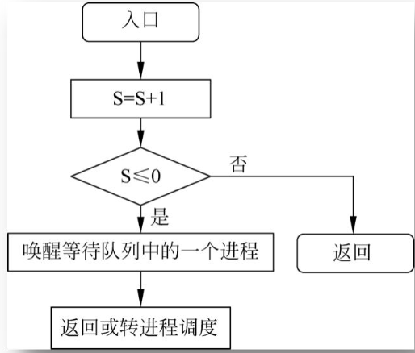

## 信號量的概念
- **信號量** 是一個整數，它代表著系統中某個資源的可用數量。
 - 當信號量 S 大於或等於零時，表示有 S 個可供並發程序使用的資源。
 - 當信號量 S 小於零時，|S| 代表有多少行程在等待該資源的使用。

## 信號量的操作
信號量只能透過 **PV 操作**（P 操作和 V 操作）來存取。

## 信號量的分類
信號量依用途的不同，分為兩種：

1. **公用信號量**：
 - 所有相關進程都可以對其進行 P 操作和 V 操作。
 - 公用信號量的初值通常為 1，用於實現進程的互斥存取（例如，保證對共享資源的獨佔存取）。

2. **私有信號量**：
 - 只有擁有該信號量的進程可以執行 P 操作，其他進程只能執行 V 操作。
 - 私有信號量的初始值常為 0 或正整數，用於實現進程同步，確保某些操作的順序性。

## P 操作和 V 操作
你所描述的P操作和V操作分別對應訊號量的「等待」（P）和「釋放」（V）操作，其主要功能如下：

1. **P操作**（等待操作）：

 **①**：將信號量S減1。

 **②**：如果S減1後的值大於或等於零，表示信號量有資源可用，進程可以繼續執行。

 **③**：如果S減1後的值小於零，表示沒有足夠資源，進程需要阻塞，並被放入信號量的等待佇列中，等待資源釋放。此時，控制權轉交給系統的進程調度。

2. **V操作**（釋放操作）：

 **①**：將信號量S加1。

 **②**：如果S加1後的值大於零，表示有資源可供其他進程使用，目前進程可以繼續執行。

 **③**：如果S加1後的值小於或等於零，表示有進程在等待該信號量，此時需要從等待佇列中喚醒一個程序並將控制權交給它。

## 用PV操作實現進程互斥

### 1. 設立一個互斥信號量S表示臨界區

- **信號量S的定義**；信號量S用來表示臨界區的資源狀態。 S的初值設為1，表示目前沒有進程在臨界區，可以進入臨界區。

 **S的值範圍：1、0、負數**

 - **S = 1**：表示沒有進程在進入臨界區，即可以有一個進程進入。
 - **S = 0**：表示已有一個行程進入臨界區，其他行程必須等待。
 - **S < 0**：表示已有一個行程進入臨界區，且有|S|個行程在等待進入臨界區。

### 2. **PV操作表示進程對臨界區的申請與釋放**
透過PV操作（P操作和V操作）控制進程的進入和退出臨界區：

- **進入臨界區之前**：
 - 進程要進入臨界區時，先執行**P(S)**操作，即「申請」信號量S。
 - 如果信號量S的值大於0（S > 0），表示沒有進程在臨界區，進程可以進入，並且將信號量S減1。
 - 如果信號量S的值為0或負數（S <= 0），則程序將被阻塞，並放入等待佇列中，等待信號量的釋放。

- **退出臨界區後**：
 - 當進程完成臨界區操作後，執行**V(S)**操作，即「釋放」信號量S。
 - 信號量S加1，表示臨界區資源被釋放，可能會喚醒等待佇列中的一個進程，允許它進入臨界區。
 - 若信號量S的值仍為非負數，其他行程可能繼續進入臨界區。

### 4. **互斥效果**
- 信號量S的作用是確保在任何時刻只有一個程序能進入臨界區。當一個行程執行P(S)時，若訊號量S的值為1，則訊號量會被減為0，表示進入臨界區，其他行程必須等待。
- 其他程序在信號量為0或負數時會被阻塞，直到信號量透過V(S)操作恢復，允許一個程序進入臨界區。

這種方式保證了臨界區的互斥性，避免了多個進程同時進入臨界區，確保了共享資源的正確管理。

### 5. **注意**
- 由於P(S)和V(S)是原子操作，它們不能中斷，因此不會發生競態條件。
- 信號量的值可能為負數，表示等待進入臨界區的進程數。這個機制允許多個進程有序地存取臨界區，而不會造成死鎖。

## 用PV操作實現進程的同步
你的總結非常全面，以下是關於PV操作實現進程同步的詳細解釋和一個實際範例：

### 同步機制
同步機制用於確保多個並發進程能夠正確、有序地協作，避免資料衝突並確保資料一致性。典型的同步機制包括PV操作和管程。

### PV操作實現進程的同步
信號量S可以用來表示一個期望的訊息，其值為「0」表示訊息尚未產生，值為非「0」表示訊息已經存在。

#### 步驟：
1. **P操作**：測試訊息是否到達。
 - 如果S>0，進程繼續執行並進入臨界區。
 - 如果S<=0，進程進入等待狀態，直到S>0。

2. **V操作**：發送訊息。
 - 增加信號量S的值，喚醒因等待信號量而阻塞的進程。

#### 注意事項：
- 定義信號量時要根據具體的問題明確其意義。
- 每個信號量與一個特定的訊息關聯，當有多個訊息時需要定義多個信號量。
- 對不同的信號量呼叫對應的P操作或V操作。