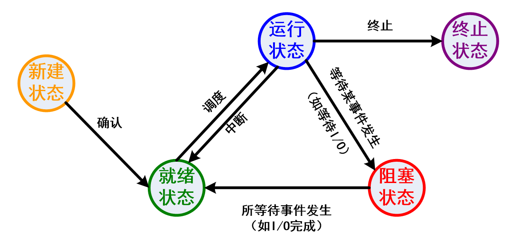

### Similar to processes, threads also have a life cycle
### The states of threads are **running**, **ready**, and **waiting**. The state transition of threads is also similar to that of processes
- For the process state of a multithreaded process, since the process is not a scheduling unit, it is not necessary to divide it into too detailed states

(Same as process)