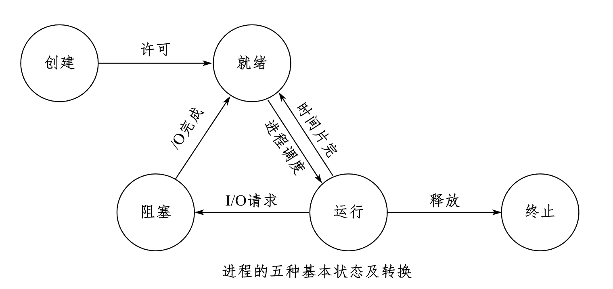

## Definition

The life cycle of a process can be divided into a set of states, which characterize the entire process. The process state reflects the life state of the process.

## Five states of a process

Generally speaking, a process has five states: **Running state, ready state, blocked (waiting) state**, created state and terminated state. The first three states are the basic states of the process.

- **Created state**: When a process is created, it needs to apply for a blank control block (PCB) and fill in the information of controlling and managing the process to complete resource allocation.
> - **Running state**: The process occupies processor resources and runs on the processor.
> - **Ready state**: The process has the conditions to run, but cannot run because it is not allocated to a processor.
> - **Blocked state**: The process cannot run temporarily because it is waiting for an event to occur (such as I/O operation).

- **Terminated state**: The process ends normally, or enters the terminated state due to an error or being terminated by the system.

## Process state transition

The three basic states of a process (ready, running, blocked) can be divided into six transition situations:

- **Ready → Running**:

When the scheduler selects the process from the ready queue, the process state changes from ready to running.

- **Running → Ready**:

When the time slice allocated to the process by the system is used up, the process changes from the running state to the ready state.

In a system with a preemptive priority scheduling algorithm, when a higher priority process is to be run, the current process is forced to give up the processor and enter the ready state.

- **Running → Blocked**:

If the running process cannot continue to execute because it is waiting for an event (such as an I/O request), the process state changes from running to blocked.

- **Blocked → Ready**:
When the event the process is waiting for is completed, the process enters the ready queue and the state changes from blocked to ready.

> **Note**: The following two state transitions are impossible:
>
> - Blocked → Running
> - Ready → Blocked