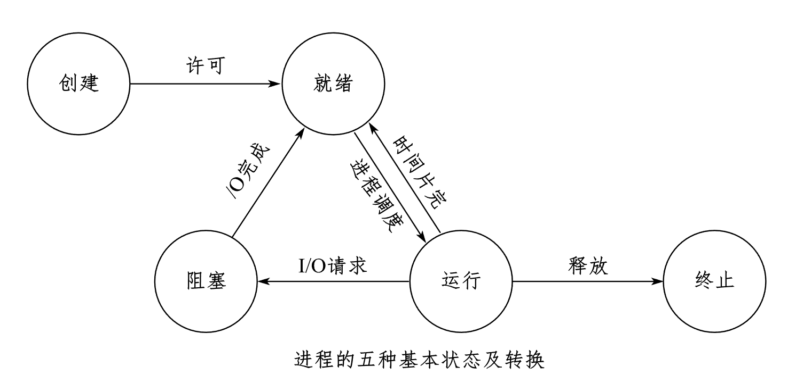

## 定義

一個行程的生命週期可以分割成一組狀態，這些狀態刻畫了整個行程。進程狀態體現了進程的生命狀態。

## 行程的五種狀態

一般來說，行程有五個狀態：**運作狀態、就緒狀態、阻塞(等待)狀態**、建立狀態和終止狀態。其中前面三種狀態是行程的基本狀態。

- **建立態**：進程在建立時需要申請一個空白控制區塊（PCB），並向其中填寫控制和管理進程的信息，以完成資源分配。
 > - **運行態**：進程佔用處理器資源，並在處理器上運行。
 > - **就緒態**：進程已具備運作條件，但因未指派到處理器而無法運作。
 > - **阻塞態**：程序因等待某個事件的發生（如 I/O 操作）而暫時無法運作。
- **終止態**：進程正常結束，或因出現錯誤，或被系統終止，進入終止狀態。

## 進程狀態的轉換

進程的三種基本狀態（就緒、運作、阻斷）之間可分為 六種轉換情況：

- **就緒 → 運轉**：

 當調度程序從就緒佇列中選擇該進程時，進程狀態會從就緒轉換為執行。

- **運行 → 就緒**：

當系統分配給該進程的時間片用完時，進程會從運行狀態轉換為就緒狀態。
在搶佔式優先權調度演算法的系統中，當有較高優先權的行程要運作時，目前行程被迫讓出處理器，進入就緒狀態。

- **運轉 → 阻塞**：

 如果正在運行的程序因等待某個事件（如 I/O 請求）而無法繼續執行，則進程狀態會從執行轉換為阻塞。

- **阻塞 → 就緒**：
 當進程所等待的事件完成後，進程進入就緒佇列，狀態從阻塞轉換為就緒。

> **注意**：以下兩種狀態轉換是不可能發生的：
>
> - 阻塞態 → 運行態
> - 就緒態 → 阻塞態